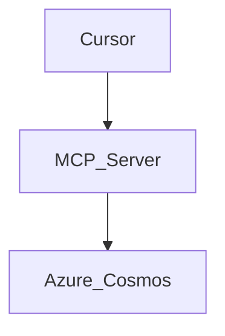

# 📚 JEFFDEV MONOREPO - DOCUMENTATION STANDARDS

## 1. THE "LIVING DOCUMENT" LAW

*Goal: Documentation is not an afterthought; it is a compilation requirement.*

* **Rule:** If a feature is shipped without a corresponding update to `apps/prism-docs` or a TSDoc comment, the task is **INCOMPLETE**.
* **The "Why" Filter:** Do not document *what* the code does (the code shows that). Document *why* it exists and *how* it connects to the Business Brain.

## 2. IN-CODE ANNOTATIONS (TSDOC)

*We write code for the "Next Developer" (who is likely us in 6 months).*

### A. Exported Functions & Components

**MANDATORY** for all files in `packages/ui` and `packages/prism-core`.

```typescript
/**
 * @component Button
 * @description A "Ghost Glow" button adhering to the JeffDev Visual Constitution.
 * Uses Headless UI for accessibility and Tailwind for the "Void" aesthetic.
 *
 * @example
 * <Button variant="holographic" onClick={execute}>
 * Deploy Engine
 * </Button>
 *
 * @param {boolean} isLoading - Triggers the "breathing" animation state.
 */
export const Button = ({...}) => { ... }

```

### B. Zod Schemas

**MANDATORY** for all API inputs. This powers the automatic API documentation.

```typescript
const UserSchema = z.object({
  // DESCRIBE the constraint, not just the type
  email: z.string().email().describe("Must be a valid corporate email. No public domains in Admin."),
});

```

## 3. PUBLIC DOCUMENTATION (`apps/prism-docs`)

*Powered by Nextra. This is the "User Manual" for Prism.*

### A. MDX Standards

* **Callouts:** Use Nextra callouts for warnings.
* `> [!WARNING] Do not edit this file manually.`


* **File Structure:**
* `pages/guide/getting-started.mdx` (The Narrative)
* `pages/api/reference.mdx` (The Raw Data)


* **Diagrams:** Use Mermaid.js code blocks for Architecture flows.



## 4. INTERNAL KNOWLEDGE (THE FOUNDER'S VAULT)

*Format for Obsidian Logs.*

When the Agent is asked to "Log this session," it must output markdown compatible with your Obsidian Vault:

1. **Tags:** `#jeffdev/build`, `#prism/v1`, `#bugfix`.
2. **Backlinks:** `[[Architecture Decision Records]]`.
3. **Format:**
```markdown
## 📝 Build Log Entry
**Date:** {{date}}
**Context:** Refactoring Auth Middleware
**Decision:** Switched from Custom JWT to Clerk for Prism SaaS.
**Rationale:** Reducing security liability for MVP.

```


## 5. THE CHANGELOG PROTOCOL

*We follow "Keep a Changelog" standards.*

**Location:** `apps/prism-dashboard/CHANGELOG.md`
**Format:**

```markdown
## [0.1.0] - 2024-05-21
### Added
- MCP Server skeleton in `apps/prism-mcp-server`.
- "Ghost Glow" Button component in `packages/ui`.
### Fixed
- Hydration mismatch in Admin Sidebar.
### Security
- Enforced Zod validation on all Server Actions.

```

---

## 6. README STANDARDS (THE ENTRY POINT)

Every package MUST have a `README.md` containing:

1. **Title:** `package-name`
2. **One-Liner:** What problem does this solve?
3. **Installation:** `npm install @jeffdev/ui`
4. **Usage:** A copy-paste example.