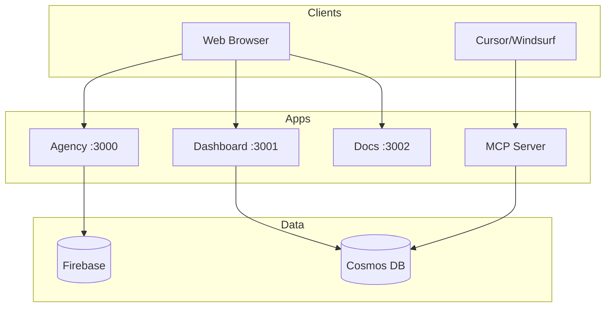

<div align="center">

# ◈ JeffDev Monorepo

**Enterprise-Grade Web Development Infrastructure**

[](https://nextjs.org/)
[](https://react.dev/)
[](https://www.typescriptlang.org/)
[](https://turbo.build/)

*Building the future of AI-assisted development*

[Agency](https://jeffdev.studio) · [Prism Docs](https://prism.jeffdev.studio) · [Changelog](./CHANGELOG.md)

</div>

---

## Overview

This monorepo powers **JeffDev Studio** — a premium web development agency — and **Prism Engine** — a context governance system for AI coding assistants.

```
┌─────────────────────────────────────────────────────────────────┐
│                     JeffDev Monorepo                            │
├─────────────────────────────────────────────────────────────────┤
│  apps/                                                          │
│  ├── agency          → Marketing site + Admin CRM               │
│  ├── prism-dashboard → SaaS platform for developers             │
│  ├── prism-docs      → Documentation (Nextra)                   │
│  └── prism-mcp-server→ AI context server (MCP)                  │
├─────────────────────────────────────────────────────────────────┤
│  packages/                                                      │
│  ├── ui              → @jdstudio/ui component library           │
│  ├── db              → Firebase + Cosmos DB clients             │
│  └── config          → Shared TypeScript/ESLint configs         │
└─────────────────────────────────────────────────────────────────┘
```

---

## Tech Stack

| Layer | Technology |
|-------|------------|
| **Framework** | Next.js 16 (App Router) |
| **UI** | React 19, Tailwind CSS, Headless UI |
| **Database** | Firebase (Agency), Azure Cosmos DB (Prism) |
| **Auth** | Clerk |
| **AI Protocol** | Model Context Protocol (MCP) |
| **Secrets** | Doppler |
| **Monorepo** | Turborepo |

---

## Applications

### 🏢 Agency (`apps/agency`)
The JeffDev Studio marketing site and client management system.
- **Port**: 3000
- **Stack**: Next.js 16, Firebase, Tailwind

### 🔮 Prism Dashboard (`apps/prism-dashboard`)
SaaS platform for developers to manage AI context rules.
- **Port**: 3001
- **Stack**: Next.js 16, Clerk Auth, Cosmos DB

### 📚 Prism Docs (`apps/prism-docs`)
Documentation for the Prism Engine.
- **Port**: 3002
- **Stack**: Nextra 4

### 🧠 Prism MCP Server (`apps/prism-mcp-server`)
AI context server implementing the Model Context Protocol.
- **Transport**: stdio
- **Tools**: `get_architectural_rules`, `validate_code_pattern`

---

## Packages

### @jdstudio/ui
Ghost Glow component library following the JeffDev Design System.

```tsx
import { Button, Card, Badge } from "@jdstudio/ui";

<Card variant="interactive">
  <Button variant="cyan">Deploy</Button>
  <Badge variant="success">Active</Badge>
</Card>
```

**Components**: Button, Card, Input, Badge, ProgressBar, DataTable

### @jeffdev/db
Unified database clients for Firebase and Azure Cosmos DB with Zod schemas.

---

## Getting Started

### Prerequisites

- Node.js 20+
- npm 10+
- [Doppler CLI](https://docs.doppler.com/docs/install-cli) (for secrets)

### Installation

```bash
# Clone repository
git clone https://github.com/jeffdev/jeffdev-monorepo.git
cd jeffdev-monorepo

# Install dependencies
npm install

# Link Doppler secrets
doppler setup

# Start all apps
doppler run -- turbo dev
```

### Development Ports

| App | URL |
|-----|-----|
| Agency | http://localhost:3000 |
| Prism Dashboard | http://localhost:3001 |
| Prism Docs | http://localhost:3002 |

---

## Architecture



---

## Scripts

```bash
# Development
doppler run -- turbo dev              # Start all apps
doppler run -- turbo dev --filter=agency  # Start agency only

# Build
turbo build                           # Build all apps
turbo build --filter=prism-dashboard  # Build specific app

# Type Checking
turbo check-types                     # Check all packages

# Database
doppler run -- npm run db:seed -w packages/db  # Seed Cosmos DB
```

---

## License

**Proprietary © 2026 JeffDev Studio. All Rights Reserved.**

This software is proprietary and confidential. Unauthorized copying, distribution, or use of this software is strictly prohibited. For licensing inquiries, contact [hello@jeffdev.studio](mailto:hello@jeffdev.studio).

---

<div align="center">

Built with ❤️ by [JeffDev Studio](https://jeffdev.studio)

</div>
