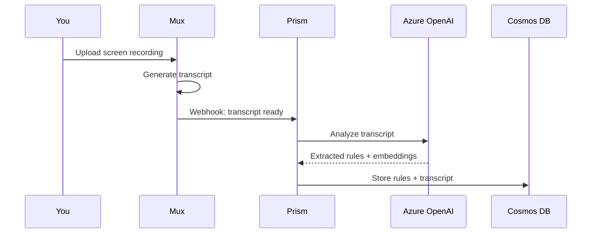

# Video Processing Guide

Learn how to extract architectural rules from screen recordings using Azure OpenAI.

## Overview

Prism Context Engine automatically processes video transcripts to extract:
- Architectural patterns and decisions
- Code style conventions
- Naming rules
- Testing strategies
- Performance best practices
- Security guidelines

## How It Works



## Step 1: Record Your Screen

Record yourself:
- Explaining architectural decisions
- Doing code reviews
- Discussing coding standards
- Walking through your codebase

**Tips for Best Results:**
- Speak clearly and at a moderate pace
- Mention specific file names, patterns, and frameworks
- Explain the "why" behind decisions
- Use concrete examples from your code

## Step 2: Upload to Prism Dashboard

1. Go to **Dashboard** → **Upload Video**
2. Drag and drop your recording or click to browse
3. Add metadata:
   - **Title**: Descriptive name (e.g., "TypeScript Best Practices")
   - **Project ID**: (Optional) Link to specific project
   - **Tags**: Help categorize the content

```typescript
// Example metadata
{
  videoTitle: "React Component Architecture - 2024",
  projectId: "my-saas-app",
  userId: "user_abc123"
}
```

## Step 3: Automatic Processing

Prism automatically:

### 3.1 Transcription (Mux)
Mux generates timestamped transcript:
```
00:00:15 - In this project, we use TypeScript for all components
00:00:23 - Never use 'any' types, always create proper interfaces
00:00:45 - Components go in src/components organized by feature
```

### 3.2 Rule Extraction (Azure OpenAI GPT-4o-mini)
AI analyzes transcript and extracts structured rules:

```json
{
  "rules": [
    {
      "title": "Enforce TypeScript Type Safety",
      "description": "Always use TypeScript with explicit types. Avoid 'any'...",
      "category": "code-style",
      "tags": ["typescript", "type-safety"],
      "priority": 2,
      "examples": {
        "good": "interface User { id: string; name: string; }",
        "bad": "const user: any = { ... }"
      }
    }
  ]
}
```

### 3.3 Embedding Generation
Creates vector embeddings for semantic search (1536 dimensions).

### 3.4 Storage
Saves to Cosmos DB:
- **VideoTranscript** collection: Full transcript + segments + embedding
- **Rules** collection: Extracted rules with links back to video

## Step 4: Review & Refine

1. Check the **Video Transcripts** page
2. View extracted rules for each video
3. Edit rules if needed:
   - Refine descriptions
   - Add more examples
   - Adjust priority
   - Add/remove tags

## Example Workflow

### Recording: TypeScript Standards Talk

```typescript
// You say in the video:
"In our codebase, we have strict TypeScript rules. 
First, never use 'any' - it defeats the purpose of TypeScript.
Second, all React components must be functional with TypeScript interfaces.
Third, API responses need Zod validation for runtime safety."
```

### AI Extracts:

**Rule 1:** Avoid 'any' Type
- Category: code-style
- Priority: 1 (critical)
- Tags: typescript, type-safety

**Rule 2:** Functional Components with TypeScript
- Category: architecture  
- Priority: 1
- Tags: react, typescript, components

**Rule 3:** Zod Validation for API Responses
- Category: security
- Priority: 2
- Tags: validation, zod, api

## Best Practices

### ✅ DO:
- Record in quiet environment
- Speak clearly about specific patterns
- Show code examples on screen
- Explain reasoning behind decisions
- Mention file paths and structure
- Use 10-20 minute segments

### ❌ DON'T:
- Record background noise
- Rush through explanations
- Use vague terms ("just make it good")
- Skip the "why" behind decisions
- Record 2+ hour sessions (break into parts)

## Supported Video Formats

Mux supports:
- **MP4** (recommended)
- **MOV**
- **AVI**
- **WebM**
- **MKV**

Max file size: **30 GB**  
Recommended: **< 5 GB** for faster processing

## Cost Estimate

Per 10-minute video:
- **Mux transcription**: Included with encoding (~$0.05)
- **Azure OpenAI processing**: ~$0.001 (GPT-4o-mini)
- **Embedding generation**: ~$0.0001

**Total**: ~$0.05 per 10-minute video

## Troubleshooting

### "Transcript not generated"
- Mux needs clear audio
- Check video has audio track
- Wait 5-10 minutes for processing

### "No rules extracted" 
- Video may not contain technical content
- AI confidence was too low
- Try more explicit technical language

### "Rules not showing in IDE"
- Run `npx prism connect` to restart MCP server
- Check MONGODB_URI is set
- Verify rules have `isActive: true`

## Next Steps

- [Search Video Transcripts](/guide/semantic-search)
- [Deploy Rules to IDE](/guide/mcp-integration)
- [Manage Rules](/guide/rules)
