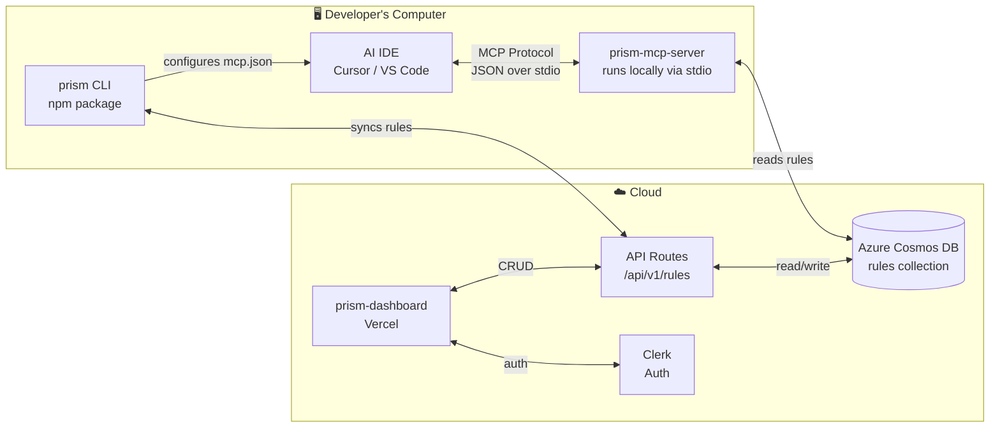

# 🔬 Prism Context Engine — Full System Report

**Branch:** `lou` · **Date:** 2026-05-21 · **Repo:** `J-Akiru5/jeffdev-monorepo`  
**Contributors:** `J-Akiru5` (Jeff/CEO), `dev-lou` (Lou/CTO)

---

## Executive Summary

Lou's documentation is **excellent and accurate**. The system architecture is sound — 3 core pieces (Dashboard, MCP Server, CLI) sharing one Cosmos DB. However, **the MCP server cannot ship today** due to a broken dependency and a startup logic bug. This report maps Lou's docs against actual code state and gives you a prioritized punch list.

> [!CAUTION]
> **2 Critical Blockers** prevent the MCP server from being stable:
>
> 1. `gpt-tokenizer` package is missing from `node_modules` — **TypeScript fails, 2 test suites fail**
> 2. `main()` calls `process.exit(0)` unless `--standalone` is passed — **IDEs can't start it**

---

## 1. Architecture Verification (Lou's Docs vs Reality)

| Lou's Claim                                          | Actual State                                                                                                                                                  | Verdict                  |
| ---------------------------------------------------- | ------------------------------------------------------------------------------------------------------------------------------------------------------------- | ------------------------ |
| Dashboard at `apps/prism-dashboard` (Port 3001)      | ✅ Exists, Next.js 16 + Clerk + Cosmos DB                                                                                                                     | ✅ Confirmed             |
| MCP Server at `apps/prism-mcp-server` (stdio)        | ✅ Exists, 9 tools registered                                                                                                                                 | ⚠️ Has blockers          |
| CLI at `packages/prism-cli` (`prism-context-engine`) | ✅ Exists, `prism serve/init/doctor/sync` commands                                                                                                            | ⚠️ Not published to npm  |
| Docs at `apps/prism-docs` (Port 3002, Nextra)        | ✅ Exists                                                                                                                                                     | ✅ Confirmed             |
| 9 MCP Tools                                          | ✅ All 9 registered in [index.ts](file:///c:/dev/Next%20Js/jeffdev-monorepo/apps/prism-mcp-server/src/index.ts#L253-L516)                                     | ✅ Confirmed             |
| Offline fallback cache                               | ✅ Full LRU cache in [cache.ts](file:///c:/dev/Next%20Js/jeffdev-monorepo/apps/prism-mcp-server/src/middleware/cache.ts) (memory+disk, 50MB limit, 30min TTL) | ✅ Confirmed             |
| Cosmos DB connection                                 | ✅ Singleton in [index.ts](file:///c:/dev/Next%20Js/jeffdev-monorepo/apps/prism-mcp-server/src/index.ts#L116-L139)                                            | ⚠️ No reconnection logic |
| API Key auth                                         | ✅ Validates against `prism.jeffdev.studio/api/api-keys/verify`                                                                                               | ✅ Confirmed             |
| Smart selection (semantic ranking)                   | ✅ Full implementation in [smart-select.ts](file:///c:/dev/Next%20Js/jeffdev-monorepo/apps/prism-mcp-server/src/middleware/smart-select.ts)                   | ⚠️ Broken import         |

---

## 2. The 9 MCP Tools — Status Matrix

| #   | Tool Name                 | Purpose                                        | Status                                              |
| --- | ------------------------- | ---------------------------------------------- | --------------------------------------------------- |
| 1   | `get_architectural_rules` | Fetch & rank rules by task (semantic search)   | ⚠️ Broken — `gpt-tokenizer` import fails at runtime |
| 2   | `validate_code_pattern`   | Check code against regex patterns              | ✅ Works                                            |
| 3   | `prism_scan`              | Playwright site scanner → auto-generate rules  | ✅ Works (needs Playwright browsers)                |
| 4   | `search_video_transcript` | Semantic search across video transcripts       | ⚠️ Needs Azure OpenAI embeddings                    |
| 5   | `get_skill`               | Fetch full skill content by ID                 | ✅ Works                                            |
| 6   | `prism_check`             | Structured code validation with line positions | ✅ Works                                            |
| 7   | `validate_code`           | Alias for `prism_check`                        | ✅ Works                                            |
| 8   | `prism_fix`               | Auto-fix violations from `prism_check`         | ✅ Works                                            |
| 9   | `repo_extract`            | AI-powered rule generation from repo scan      | ✅ Works (needs AI router)                          |

---

## 3. Test Results (Ran 2026-05-21)

```
 ✓ src/tools/prism-fix.test.ts          (7 tests)   ✅
 ✓ src/middleware/client-detector.test.ts (10 tests)  ✅
 ✓ src/lib/vector-search.test.ts         (17 tests)  ✅
 ✓ src/tools/prism-check.test.ts         (7 tests)   ✅
 ✓ src/middleware/platform-formatter.test.ts (12 tests) ✅
 ✓ src/middleware/cache.test.ts           (12 tests)  ✅
 ✓ src/tools/repo-extract.test.ts        (4 tests)   ✅
 ✓ tests/integration.test.ts             (14 tests | 8 skipped) ✅
 ✓ src/tools/prism-scan.test.ts          (15 tests)  ✅
 ✗ src/middleware/smart-select.test.ts    FAIL — Cannot find package 'gpt-tokenizer'
 ✗ src/middleware/token-counter.test.ts   FAIL — Cannot find package 'gpt-tokenizer'

 Test Files:  2 failed | 9 passed (11)
 Tests:       90 passed | 8 skipped (98)
```

> [!IMPORTANT]
> The `gpt-tokenizer` package is listed in [package.json](file:///c:/dev/Next%20Js/jeffdev-monorepo/apps/prism-mcp-server/package.json) as `"gpt-tokenizer": "^3.4.0"` but **isn't resolving**. This is likely a pnpm hoisting issue or the package wasn't installed after being added.

---

## 4. Critical Bugs Found

### 🔴 BUG #1: Missing `gpt-tokenizer` Dependency

**Files affected:**

- [smart-select.ts:1](file:///c:/dev/Next%20Js/jeffdev-monorepo/apps/prism-mcp-server/src/middleware/smart-select.ts#L1) — `import { countTokens as gptCountTokens } from "gpt-tokenizer"`
- [token-counter.ts:1](file:///c:/dev/Next%20Js/jeffdev-monorepo/apps/prism-mcp-server/src/middleware/token-counter.ts#L1) — `import { countTokens } from "gpt-tokenizer"`

**Impact:** TypeScript check fails, 2 test suites fail, `get_architectural_rules` (the primary tool) will crash at runtime when called with a `task` parameter.

**Fix:**

```bash
pnpm --filter prism-mcp-server install
# OR if the package isn't in node_modules:
pnpm --filter prism-mcp-server add gpt-tokenizer
```

---

### 🔴 BUG #2: MCP Server Exits Immediately Without `--standalone`

**File:** [index.ts:910-920](file:///c:/dev/Next%20Js/jeffdev-monorepo/apps/prism-mcp-server/src/index.ts#L910-L920)

```typescript
async function main() {
  const isStandalone = process.argv.includes("--standalone");
  if (!isStandalone) {
    // ...prints banner...
    process.exit(0); // ❌ EXITS!
  }
  // ... server only starts if --standalone is passed
}
```

**Impact:** Lou's docs say IDEs should run `prism serve` which spawns this server. But the server **kills itself immediately** unless `--standalone` is passed. This means:

- Direct `node dist/index.js` → exits
- IDE spawning it without `--standalone` → exits

**Clash with Lou's IDE config:**

```json
{ "command": "prism", "args": ["serve"] }
```

The `serve` command in the CLI needs to pass `--standalone` when spawning the MCP process, OR this guard should be removed/relaxed.

---

### 🟡 BUG #3: No DB Reconnection Logic

**File:** [index.ts:116-139](file:///c:/dev/Next%20Js/jeffdev-monorepo/apps/prism-mcp-server/src/index.ts#L116-L139)

The `getDB()` function connects once and caches the connection. If Cosmos DB drops the connection (common with Azure's idle timeouts), **every subsequent tool call will fail** until the process is restarted.

**Fix needed:** Add connection health check or reconnection wrapper.

---

### 🟡 BUG #4: `PHASE2_COMPLETE.md` Documents Stale IDE Config

Lou's docs (ide-connection-commands.html) correctly show:

```json
{ "command": "prism", "args": ["serve"] }
```

But [PHASE2_COMPLETE.md](file:///c:/dev/Next%20Js/jeffdev-monorepo/apps/prism-mcp-server/PHASE2_COMPLETE.md#L91-L106) still references `"prism connect"` as the command, which is an older pattern.

---

## 5. What's Missing to Go Live (Verified Against Lou's Doc)

| #   | What                                         | Owner    | Difficulty                         | Status                   |
| --- | -------------------------------------------- | -------- | ---------------------------------- | ------------------------ |
| 1   | Fix `gpt-tokenizer` dependency               | **Lou**  | 🟢 Easy — `pnpm install`           | 🔴 Blocking              |
| 2   | Fix `--standalone` startup guard             | **Lou**  | 🟢 Easy — remove or adjust guard   | 🔴 Blocking              |
| 3   | Add DB reconnection logic                    | **Lou**  | 🟡 Medium — wrap `getDB()`         | 🟡 Important             |
| 4   | Publish CLI to npm (`prism-context-engine`)  | **Jeff** | 🟢 Easy — `npm publish`            | 🔴 Blocking go-live      |
| 5   | Deploy dashboard to Vercel                   | **Jeff** | 🟡 Medium — Doppler secrets needed | 🔴 Blocking go-live      |
| 6   | Deploy docs to Vercel                        | **Jeff** | 🟢 Easy — Nextra standard deploy   | 🟡 Important             |
| 7   | Configure Doppler secrets for Vercel         | **Jeff** | 🟡 Medium — already has Doppler    | 🔴 Blocking deploy       |
| 8   | Set DNS for prism.jeffdev.studio             | **Jeff** | 🟢 Easy — DNS records              | 🟡 Important             |
| 9   | End-to-end smoke test (CLI → MCP → DB → IDE) | **Both** | 🟡 Medium                          | 🔴 Must do before launch |

---

## 6. Kanban-Ready GitHub Issues

> [!NOTE]
> GitHub MCP isn't authenticated right now. Below are the exact issues ready to paste into GitHub Projects. Each has a title, description, labels, assignee, and sprint.

---

### Sprint 1: MCP Server Stability 🔴 (THIS WEEK)

---

#### Issue 1: `[BUG] Fix gpt-tokenizer missing dependency`

**Labels:** `bug`, `priority:critical`, `mcp-server`  
**Assignee:** `dev-lou`  
**Sprint:** Sprint 1

**Description:**
`gpt-tokenizer` is listed in package.json but isn't resolving. TypeScript check fails with:

```
Cannot find module 'gpt-tokenizer' or its corresponding type declarations
```

**Files:** `src/middleware/smart-select.ts:1`, `src/middleware/token-counter.ts:1`

**Acceptance Criteria:**

- [ ] `pnpm --filter prism-mcp-server run check-types` passes
- [ ] `pnpm --filter prism-mcp-server run test` — all 11 test files pass
- [ ] `smart-select.test.ts` and `token-counter.test.ts` are green

---

#### Issue 2: `[BUG] Remove --standalone guard from main() startup`

**Labels:** `bug`, `priority:critical`, `mcp-server`  
**Assignee:** `dev-lou`  
**Sprint:** Sprint 1

**Description:**
`main()` in `src/index.ts` (line 910-920) calls `process.exit(0)` unless `--standalone` is passed. IDEs spawn the server without this flag, so the server immediately exits.

**Options:**

1. Remove the guard entirely (recommended for v1)
2. Make it detect stdio transport automatically
3. Have the CLI's `serve` command pass `--standalone`

**Acceptance Criteria:**

- [ ] MCP server starts when launched by IDE (no `--standalone` needed)
- [ ] `prism serve` in CLI successfully starts the server

---

#### Issue 3: `[FEAT] Add Cosmos DB reconnection/health-check logic`

**Labels:** `enhancement`, `priority:high`, `mcp-server`  
**Assignee:** `dev-lou`  
**Sprint:** Sprint 1

**Description:**
`getDB()` connects once and caches. Azure Cosmos DB has idle connection timeouts. If the connection drops, every tool call fails silently until process restart.

**Implementation:**

- Wrap `getDB()` with a `try/catch` that resets `client`/`rulesCollection` on connection error
- Add a `ping` before returning cached connection, or catch `MongoNotConnectedError` and reconnect

**Acceptance Criteria:**

- [ ] MCP server recovers from dropped DB connections without restart
- [ ] Add unit test for reconnection behavior

---

#### Issue 4: `[FEAT] End-to-end smoke test script`

**Labels:** `testing`, `priority:high`, `mcp-server`  
**Assignee:** `dev-lou`  
**Sprint:** Sprint 1

**Description:**
Create a script at `apps/prism-mcp-server/scripts/smoke-test.ts` that:

1. Starts the MCP server via stdio
2. Sends a `ListTools` request
3. Sends a `get_architectural_rules` call with a test task
4. Verifies the response contains rules
5. Exits with code 0 on success

**Acceptance Criteria:**

- [ ] `pnpm --filter prism-mcp-server run smoke-test` passes
- [ ] Works without MONGODB_URI (uses cache fallback)

---

### Sprint 2: CLI & Deployment 🟡 (NEXT WEEK)

---

#### Issue 5: `[FEAT] Publish prism-context-engine to npm`

**Labels:** `release`, `priority:critical`, `cli`  
**Assignee:** `J-Akiru5` (Jeff)  
**Sprint:** Sprint 2

**Description:**
Users can't run `npm install -g prism-context-engine` until this is published.

**Steps:**

1. Verify `packages/prism-cli/package.json` has correct name/version
2. Build: `pnpm --filter prism-context-engine run build`
3. Publish: `npm publish --access public`
4. Test: `npm install -g prism-context-engine && prism --version`

**Acceptance Criteria:**

- [ ] `npm install -g prism-context-engine` works globally
- [ ] `prism doctor` runs without errors

---

#### Issue 6: `[INFRA] Configure Doppler secrets for Vercel`

**Labels:** `infrastructure`, `priority:critical`  
**Assignee:** `J-Akiru5` (Jeff)  
**Sprint:** Sprint 2

**Description:**
Doppler secrets need to be injected into Vercel for deployment. Required vars:

- `NEXT_PUBLIC_CLERK_PUBLISHABLE_KEY`
- `CLERK_SECRET_KEY`
- `MONGODB_URI` (Cosmos connection string)
- `COSMOS_DATABASE_NAME`
- `NEXT_PUBLIC_SITE_URL`

**Acceptance Criteria:**

- [ ] Doppler → Vercel integration configured
- [ ] Environment variables visible in Vercel project settings

---

#### Issue 7: `[INFRA] Deploy prism-dashboard to Vercel`

**Labels:** `infrastructure`, `priority:critical`, `dashboard`  
**Assignee:** `J-Akiru5` (Jeff)  
**Sprint:** Sprint 2

**Description:**
Deploy `apps/prism-dashboard` to Vercel at `prism.jeffdev.studio`.

**Depends on:** Issue 6 (Doppler secrets)

**Acceptance Criteria:**

- [ ] https://prism.jeffdev.studio loads
- [ ] Sign up/login works via Clerk
- [ ] API key generation works

---

#### Issue 8: `[INFRA] Deploy prism-docs to Vercel`

**Labels:** `infrastructure`, `priority:medium`, `docs`  
**Assignee:** `J-Akiru5` (Jeff)  
**Sprint:** Sprint 2

**Description:**
Deploy `apps/prism-docs` (Nextra 4) to Vercel at `docs.prism.jeffdev.studio`.

**Acceptance Criteria:**

- [ ] Docs site is publicly accessible
- [ ] All 7 pages load correctly

---

#### Issue 9: `[INFRA] Configure DNS for prism.jeffdev.studio`

**Labels:** `infrastructure`, `priority:medium`  
**Assignee:** `J-Akiru5` (Jeff)  
**Sprint:** Sprint 2

**Description:**
Point `prism.jeffdev.studio` and `docs.prism.jeffdev.studio` to Vercel via DNS.

**Acceptance Criteria:**

- [ ] CNAME records configured
- [ ] SSL certificates auto-provisioned

---

### Sprint 3: Polish & Launch 🟢 (WEEK 3)

---

#### Issue 10: `[FEAT] Verify prism init writes correct IDE configs`

**Labels:** `enhancement`, `priority:medium`, `cli`  
**Assignee:** `dev-lou`  
**Sprint:** Sprint 3

**Description:**
Lou's docs define exact config formats for Cursor, VS Code, Windsurf, and Claude Desktop. Verify `prism init` writes configs matching these specs.

**Acceptance Criteria:**

- [ ] Config matches Cursor format (`~/.cursor/mcp.json`)
- [ ] Config matches VS Code format (`settings.json → mcp.servers`)
- [ ] Config matches Windsurf format (`~/.windsurf/mcp.json`)

---

#### Issue 11: `[FEAT] Implement prism doctor health checks`

**Labels:** `enhancement`, `priority:medium`, `cli`  
**Assignee:** `dev-lou`  
**Sprint:** Sprint 3

**Description:**
Lou's docs say `prism doctor` runs 10 checks. Verify all are implemented:

1. Node version
2. CLI installed
3. Login state
4. Rules cached locally
5. Dashboard reachable
6. IDE config found
7. MCP server startable
8. DB connection
9. API key valid
10. Cache stats

---

#### Issue 12: `[DOCS] Update PHASE2_COMPLETE.md — stale IDE config`

**Labels:** `documentation`, `priority:low`  
**Assignee:** `dev-lou`  
**Sprint:** Sprint 3

**Description:**
PHASE2_COMPLETE.md still references `"prism connect"` as the IDE command. Lou's docs correctly use `"prism serve"`. Update or archive the phase docs.

---

#### Issue 13: `[FEAT] Re-implement search_video_transcript with Azure OpenAI`

**Labels:** `enhancement`, `priority:medium`, `mcp-server`  
**Assignee:** `dev-lou`  
**Sprint:** Sprint 3

**Description:**
As documented in PHASE2_CLEANUP.md — the `search_video_transcript` tool was stripped to fix build. Re-implement with:

- Azure OpenAI text embeddings
- Cosine similarity ranking
- Proper error handling + tests

---

#### Issue 14: `[FEAT] Cosmos DB data seeding script`

**Labels:** `enhancement`, `priority:medium`, `mcp-server`  
**Assignee:** `dev-lou`  
**Sprint:** Sprint 3

**Description:**
Need a seed script to populate Cosmos DB with sample rules, projects, and a test user for demo/testing purposes.

**Acceptance Criteria:**

- [ ] Script creates 5+ sample rules across categories
- [ ] Script creates a test project
- [ ] Can be run repeatedly (idempotent)

---

## 7. Immediate Action Items (Do RIGHT NOW)

### For Lou (CTO) — Code Fixes

```bash
# 1. Fix the missing dependency
cd "c:\dev\Next Js\jeffdev-monorepo"
pnpm --filter prism-mcp-server install
# If that doesn't work:
pnpm --filter prism-mcp-server add gpt-tokenizer

# 2. Verify fix
pnpm --filter prism-mcp-server run check-types
pnpm --filter prism-mcp-server run test

# 3. Fix the --standalone guard in src/index.ts:910-920
# Remove the process.exit(0) or make it detect stdio
```

### For Jeff (CEO) — Infrastructure

```bash
# 1. Verify Doppler has all Prism secrets
doppler secrets --project prism

# 2. Set up Vercel project for prism-dashboard
# 3. Configure Doppler → Vercel integration
# 4. Set DNS records for prism.jeffdev.studio
```

---

## 8. Architecture Diagram (Verified)



---

> [!TIP]
> **Priority Order:** Fix `gpt-tokenizer` → Remove `--standalone` guard → Add DB reconnection → Smoke test → Publish CLI → Deploy. Everything else is polish.
>
> ---
>
> ## 9. Fixes Applied (2026-05-22)
>
> | Bug                         | Status   | Details                                                                                 |
> | --------------------------- | -------- | --------------------------------------------------------------------------------------- |
> | #1 `gpt-tokenizer` missing  | ✅ Fixed | `pnpm install` restored the dependency. All 11 test files pass, 109 tests green.        |
> | #2 `--standalone` guard     | ✅ Fixed | Removed guard entirely. Server starts unconditionally, detects stdio transport.         |
> | #3 DB reconnection          | ✅ Fixed | Added connection health check (ping) + retry on failure. Resets cached client on error. |
> | #4 PHASE2_COMPLETE.md stale | ✅ Fixed | Updated all IDE config examples from `prism connect` → `prism serve`.                   |
